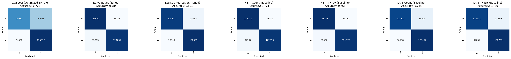
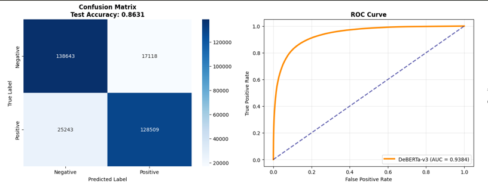

# README — My work on Twitter Sentiment Analysis

This README documents only my work, the exact experiments I ran, and the results I obtained.

## Dataset

- File used: `/kaggle/input/sentiment140/training.1600000.processed.noemoticon.csv`
- Kaggle dataset page: https://www.kaggle.com/datasets/kazanova/sentiment140

## Data Preprocessing

Goal: To prepare the raw tweet data for modeling.
First, I check whether the dataset contains any emojis.
Then, I create a function called `preprocess_tweet()` to clean and standardize the text data.
This function performs the following steps:

- Converts all text to lowercase

- Removes URLs, numbers, and punctuation marks

- Normalizes repeated characters (e.g., “soooo” → “soo”)

- Handles negations (“not good” → “not_good”)

- Splits hashtags (“#BestDayEver” → “best day ever”)

- Replaces slang words (“u” → “you”, “pls” → “please”)

- Removes stopwords and applies lemmatization

Stopword removal means filtering out words that do not add meaningful information (e.g., “the”, “is”, “at”).
Lemmatization converts words to their base form (e.g., “running” → “run”).
Tokenization splits text into individual words or tokens.

By doing this, the tweets become simplified and machine-readable.
I first apply the preprocessing function to a sample tweet to test it, and then to the entire dataset.
Since the preprocessing function does not learn from the data but only transforms it, it does not cause data leakage — so I can safely apply it to all samples.
Finally, I store the cleaned text in a new column in the dataset (in the notebooks this is `df['clean_text']`).

## WordCloud

I generate a WordCloud from the cleaned text to visualize frequent terms. The notebook saves the image when the plotting cell runs. Example path I used in the notebook:


## Explanation of First Notebook

- Naive Bayes (Count / TF-IDF)
- Logistic Regression (Count / TF-IDF, GridSearchCV tuned)
- XGBoost (TF-IDF + RandomizedSearchCV tuned)

I ran evaluation and comparison code in `notebooks/ml-modeling.ipynb` which produces the confusion matrices, ROC curves, and comparison tables for these models.

## Results images




## Explanation of Second Notebook

### LSTM & BiLSTM (GloVe) — `notebooks/lstm-bilstm.ipynb`

This notebook is my RNN-based experiment using pre-trained GloVe embeddings and both a unidirectional LSTM and a bidirectional LSTM.

What I did (exact steps from the notebook):

- Configured paths and data sources:

  - CSV used: `/kaggle/input/sentiment140/training.1600000.processed.noemoticon.csv`
  - GloVe embeddings used: `/kaggle/input/glove6b100dtxt/glove.6B.100d.txt`

- Preprocessing (`preprocess_for_cnn`):

  - Lowercased text
  - Removed URLs and @mentions
  - Stripped the leading `#` from hashtags (keeps the words)
  - Removed numbers and non-word characters
  - Normalized repeated characters (e.g. `loooove` → `loove`)
  - Handled simple negations (`not good` → `not_good`)
  - Removed stopwords and applied lemmatization
  - Result stored in `df['clean_text']`

- Tokenization and sequences:

  - Built a Keras `Tokenizer` (vocab limited by `MAX_WORDS`) on the training data
  - Converted texts to integer sequences and padded to `MAX_LEN`

- GloVe embedding matrix:

  - Loaded `glove.6B.100d.txt` and built an `embedding_matrix` aligned with the tokenizer's word index
  - Used the pre-trained vectors to initialize the Keras Embedding layer

- Models (implemented and trained):

  - LSTM model: Embedding (GloVe, non-trainable) → LSTM(128) → Dropout → Dense(64) → Dropout → Dense(1, sigmoid)
  - BiLSTM model: Embedding (GloVe, non-trainable) → Bidirectional(LSTM(128)) → Dropout → Dense(64) → Dropout → Dense(1, sigmoid)

- Training details:

  - Optimizer: Adam (lr ~0.001 in the notebook)
  - Loss: binary_crossentropy
  - Metrics: accuracy
  - EarlyStopping and ReduceLROnPlateau callbacks used (monitoring `val_loss`, restore best weights)
  - Quick test epochs vs full training epochs are parameterized (`EPOCHS_QUICK`, `EPOCHS_FULL`)

  ### Numeric results (from my run)

  === LSTM MODEL ===
  Accuracy: 0.7892
  Precision: 0.7676
  Recall: 0.8296
  F1 Score: 0.7974

  Classification Report:

  ```
                precision    recall  f1-score   support

            0     0.8146    0.7488    0.7803    160000
            1     0.7676    0.8296    0.7974    160000

     accuracy                         0.7892    320000
    macro avg     0.7911    0.7892    0.7888    320000
  weighted avg     0.7911    0.7892    0.7888    320000
  ```

  Confusion Matrix:

  ```
  [[119811  40189]
   [ 27272 132728]]
  ```

  === BiLSTM MODEL ===
  Accuracy: 0.7875
  Precision: 0.8040
  Recall: 0.7603
  F1 Score: 0.7815

  Classification Report:

  ```
                precision    recall  f1-score   support

            0     0.7727    0.8146    0.7931    160000
            1     0.8040    0.7603    0.7815    160000

     accuracy                         0.7875    320000
    macro avg     0.7883    0.7875    0.7873    320000
  weighted avg     0.7883    0.7875    0.7873    320000
  ```

  Confusion Matrix:

  ```
  [[130342  29658]
   [ 38349 121651]]
  ```

## Third Notebook: BERT Fine-tuning — `notebooks/sentiment-analysis-using-bert-with-accuracy-85.ipynb`

This notebook is my Transformer-based experiment using BERT (Bidirectional Encoder Representations from Transformers) for sentiment classification.

What I did (key setup from the notebook):

- Model used: `bert-base-uncased`
- Key hyperparameters:

  - max sequence length: 64
  - batch size: 32
  - total epochs: 5
  - learning rate: 2e-5
  - dropout probabilities: 0.3 (hidden and attention)

- Training setup:

  - Optimizer: AdamW with linear warmup scheduler
  - Loss: binary crossentropy (via HuggingFace's built-in loss)
  - Early stopping with patience=1 (monitoring validation loss)
  - Mixed precision training (AMP) when CUDA available
  - Checkpointing and model saving at each epoch

- Data preprocessing (simplified for BERT):
  - Removed URLs and mentions
  - Cleaned punctuation and extra whitespace
  - Lowercased text
  - Used BERT tokenizer with padding and truncation

### Numeric results (from my run)

=== Final Test Results ===
Test loss: 0.3509, Test acc: 0.8593, Test f1: 0.8591

Classification report (test):

```
              precision    recall  f1-score   support

          0     0.8362    0.8936    0.8639     80000
          1     0.8858    0.8249    0.8543     80000

   accuracy                         0.8593    160000
  macro avg     0.8610    0.8593    0.8591    160000
weighted avg     0.8610    0.8593    0.8591    160000
```

This BERT model achieved **85.93% test accuracy** and **85.91% macro F1-score**, which is significantly higher than the LSTM/BiLSTM results (~78-79%). The precision and recall are well-balanced for both classes (negative and positive sentiment).


## Fourth Notebook: DeBERTa-v3 Fine-tuning — `notebooks/sentiment-analysis-debarta-v3.ipynb`

This notebook represents my most advanced Transformer experiment using DeBERTa-v3 (Decoding-enhanced BERT with Disentangled Attention), Microsoft's state-of-the-art model that improves upon BERT's architecture.

What I did (key setup from the notebook):

- Model used: `microsoft/deberta-v3-base`
- Enhanced hyperparameters:

  - max sequence length: 128 (increased from BERT's 64)
  - batch size: 32
  - total epochs: 4 (reduced to prevent overfitting)
  - learning rate: 8e-6 (much lower than BERT's 2e-5)
  - weight decay: 0.02 (increased regularization)
  - dropout rate: 0.4 (higher than BERT's 0.3)
  - gradient accumulation steps: 2
  - warmup ratio: 0.15 (extended warmup period)

- Advanced training setup:

  - Optimizer: AdamW with cosine scheduler (better than linear for DeBERTa)
  - Enhanced regularization: label smoothing (0.1), weight decay, higher dropout
  - Aggressive early stopping (patience=1)
  - Mixed precision training (AMP) for efficiency
  - On-the-fly tokenization with dynamic padding (memory-friendly)
  - Comprehensive overfitting monitoring

- Conservative preprocessing (to preserve natural language patterns):
  - Minimal cleaning to avoid overfitting to specific patterns
  - Removed URLs and mentions
  - Preserved important punctuation for sentiment
  - Kept case sensitivity for model to learn from
  - Comprehensive data leakage prevention and duplicate removal

### Numeric results (from my run)

🎯 Test Accuracy : 0.8631 (86.31%)

🎯 Test F1-Score : 0.8630

🎯 Test ROC AUC : 0.9384 (93.84%)

📈 Best Val Accuracy: 0.8635

⏱️ Training Epochs : 1

🎛️ Model Parameters : 184,423,682

📋 Per-Class Performance:
Negative: Precision=0.8460, Recall=0.8901, F1=0.8675
Positive: Precision=0.8825, Recall=0.8358, F1=0.8585


